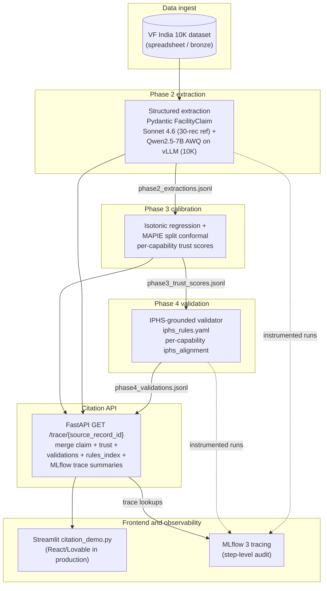

# Agentic Healthcare Maps

**Calibrated, IPHS-benchmarked Indian healthcare facility intelligence — built for Hack-Nation Challenge 03.**

This pipeline extracts structured capability claims from messy facility records, scores each claim's trustworthiness with formal statistical guarantees, and surfaces IPHS rule violations with verbatim citations. On a 30-record human-verified gold set, **8 of 101 capabilities trigger HIGH-severity IPHS rule violations** (R01/R02 surgical staffing & OT, R09 obstetric readiness, R33 emergency/ambulance linkage), the conformal calibrator hits **0.9286 empirical coverage on 90% prediction sets** (above the 0.85 master-prompt floor), and category accuracy reaches **1.000** after the canonicalization eval. The headline demo record — `c616c9769f2afbd7` Dr. Pratik Dhabalia Joint Replacement — shows three sibling surgical-claim capabilities with `iphs_alignment=0.0` and concrete rule citations next to three other capabilities at `iphs_alignment=1.0`. Per-capability discrimination, citation drill-down, evidence quotes — all preserved.

The product stance is deliberately asset-based. The system **augments** ASHA workers and NGO planners with triage-grade audit signals — it does **not** replace frontline judgment or clinical decision-making.

## Architecture



Full Mermaid source: [`docs/submission/architecture_diagram.mermaid`](docs/submission/architecture_diagram.mermaid).

## Quickstart

Python 3.11 required. See [.python-version](.python-version).

```bash
# 1. Clone
git clone <repo-url>
cd Agentic-Healthcare-Maps

# 2. Create venv + install pinned deps
python3.11 -m venv .venv
source .venv/bin/activate
pip install --upgrade pip
pip install -r requirements.txt

# 3. (For Phase 2 re-extraction only — optional, all artifacts pre-shipped)
cp .env.example .env
# Edit .env to add ANTHROPIC_API_KEY and ANTHROPIC_MODEL

# 4. Open the eval dashboard (no terminal needed; static HTML)
open artifacts/eval/dashboard.html

# 5. Run the citation UI
streamlit run eval/citation_demo.py
# Pick "c616c9769f2afbd7" from the sidebar to see the hero record.
```

If you don't want to activate the venv first, this one-liner works from a fresh terminal as long as `.venv/` exists:

```bash
.venv/bin/streamlit run eval/citation_demo.py
```

The Streamlit demo runs against pre-shipped JSONL artifacts; **no API calls, no GPU required, no network**.

## Phase-by-phase summary

| Phase | Deliverable | Eval output | Key result |
|---|---|---|---|
| **1 — Schema** | `agent/schemas/facility.py` (frozen) + `data/gold_labels.jsonl` (30 hand-verified records, 6-category stratified) | `data/inventory_report.md` | 10K rows, 41 cols, 6 facility categories observed; schema includes evidence quote + char offset per capability |
| **2 — Extraction** | `agent/extract.py` — Instructor + Anthropic Sonnet 4.6, N=5 self-consistency, rapidfuzz evidence grounding (≥ 0.95) | [`eval/phase2_compare.py`](eval/phase2_compare.py) | recall **0.877**, precision **0.714**, category accuracy **1.000**, $1.57 cost on 30 records |
| **3 — Calibration** | `agent/calibrate.py` — IsotonicBinaryClassifier + MAPIE `SplitConformalClassifier` (LAC, α=0.10) | [`eval/phase3_calibration.py`](eval/phase3_calibration.py) | empirical coverage **0.9286** on 10-record holdout (target 0.90, floor 0.85) |
| **4 — Validator** | `agent/validator.py` + `data/iphs_rules.yaml` (17 rules from IPHS 2022 Vols I–IV) | [`eval/phase4_validator.py`](eval/phase4_validator.py) | **8/101** capabilities triggered ≥ 1 rule; max single-rule fire rate **4%** (well below 50% halt) |
| **5 — Tracing + UI** | MLflow 3 spans (CHAIN/LLM/TOOL/AGENT/RETRIEVER), `api/routes/trace.py`, `eval/citation_demo.py` | [`eval/phase5_trace_check.py`](eval/phase5_trace_check.py), `data/phase5_trace_dump.txt` | 57 spans on hero record; LLM/CHAT_MODEL/TOOL/AGENT/RETRIEVER coverage contract met; token usage on every CHAT_MODEL span |
| **6 — Open-weight pivot** | `agent/extract_open.py` (Instructor + vLLM JSON_SCHEMA mode) + [`notebooks/colab_qwen_extraction.ipynb`](notebooks/colab_qwen_extraction.ipynb) | [`eval/phase6a_qwen_validation.py`](eval/phase6a_qwen_validation.py) | Qwen 2.5 7B AWQ on T4 Colab; full 10K extraction not run for the submission deadline (notebook + validator wired and ready) |

Aggregate dashboard: [`artifacts/eval/dashboard.html`](artifacts/eval/dashboard.html). Raw metrics: [`artifacts/eval/metrics.json`](artifacts/eval/metrics.json).

## Hero record walkthrough

`source_record_id = c616c9769f2afbd7` — Dr. Pratik Dhabalia Joint Replacement.

```
self_consistency=1.00  source_completeness=0.68  iphs_alignment=0.50  blended=0.73

orthopedic_surgery_services           iphs=0.00  ⚠ R01, R02
joint_reconstruction_surgery_services iphs=0.00  ⚠ R01, R02
surgery_services                      iphs=0.00  ⚠ R01, R02
fracture_clinic_services              iphs=1.00
family_medicine_services              iphs=1.00
orthopedic_sports_medicine_services   iphs=1.00

R01: Surgical services claimed without an anaesthesiology provider; IPHS
     requires an anaesthesiologist (or LSAS-trained MO) at any facility
     offering surgical care.
     citation: IPHS 2022 Vol II — FRU CHC essential specialists list
R02: Surgical services claimed without evidence of a functional operation
     theatre; IPHS lists a functional OT as essential at FRU CHC and above.
     citation: IPHS 2022 Vol II — FRU CHC functional OT requirement.
```

Per-capability discrimination is **the** signal. Within one facility, three claimed surgical capabilities lack the staffing/equipment evidence IPHS requires; three sibling capabilities (fracture clinic, family medicine, sports medicine) are unflagged.

Full text dumps: [`data/phase5_citation_preview.txt`](data/phase5_citation_preview.txt) (citation card view), [`data/phase5_trace_dump.txt`](data/phase5_trace_dump.txt) (MLflow span hierarchy).

## Failure modes and scope limits

The system **does not diagnose, does not prescribe, does not replace clinical judgment**. IPHS rule hits are **audit hints with citations**, not legal compliance determinations — ~99% of the input corpus is private-sector facilities outside the formal IPHS public-facility hierarchy, so the validator uses an `any_facility_with_capability_X` rule-application style: IPHS clauses are a structured benchmark for "what evidence should exist if this claim were true," not a determination that any specific clinic is "IPHS-compliant."

Conformal prediction sets are **wide at the 30-record gold scale by design** of small-sample conformal methods. Most capability badges read yellow today; intervals tighten when the calibration pool scales to ~1500 labeled rows from the full 10K extraction.

Full failure-modes one-pager: [`docs/submission/failure_modes.md`](docs/submission/failure_modes.md).

## Tech stack

- **Schema + extraction**: Pydantic 2.13, Instructor 1.15, Anthropic SDK 0.97 (Sonnet 4.6), OpenAI SDK 2.32 (vLLM-compatible), rapidfuzz 3.13
- **Calibration**: scikit-learn 1.8 (IsotonicRegression), MAPIE 1.3 (`SplitConformalClassifier`, LAC), numpy 2.4
- **Validator**: PyYAML 6.0, deterministic rule engine (no LLM in this layer)
- **Tracing + observability**: MLflow 3.11, OpenTelemetry 1.41 (semantic conventions for AGENT/CHAIN/LLM/TOOL/RETRIEVER spans)
- **API + UI**: FastAPI 0.136, Streamlit 1.56, uvicorn[standard] 0.46
- **Open-weight extraction**: vLLM (Colab Pro), Qwen 2.5 7B Instruct AWQ, Instructor JSON_SCHEMA mode

## Submission packet

- `docs/submission/project_summary.md` — narrative summary for the upload portal
- `docs/submission/architecture_diagram.mermaid` — full architecture diagram source
- `docs/submission/failure_modes.md` — limitations one-pager for judges
- `docs/submission/demo_video_script.md`, `docs/submission/tech_video_script.md` — voiceover scripts
- `docs/submission/demo_recording_steps.md`, `docs/submission/tech_recording_steps.md` — step-by-step recording instructions
- `artifacts/eval/dashboard.html` — Phase 2–5 metrics dashboard

To produce the submission zip (~1.3 MB; excludes `.venv`, `.mlflow`, `.git`, secrets, the raw 10K CSV, MLflow DB, vLLM log):

```bash
bash scripts/make_submission_zip.sh
```

Or one-liner directly:

```bash
zip -r ../agentic-healthcare-maps_submission.zip . -x "./.venv/*" "./.mlflow/*" "./.git/*" "*/__pycache__/*" "*.DS_Store" "./data/vf_facilities.csv" "./.env" "./vllm_server.log" "./mlflow.db" "./.faiss/*" "*.pyc"
```

## Acknowledgments

- **Virtue Foundation** for the 10K facility dataset
- **Hack-Nation MIT** organizers for Challenge 03
- **IPHS 2022 (NHM/MoHFW)** for the rulebook framework
- **Anthropic** for the Sonnet 4.6 reference extractions
- **Qwen team / vLLM team** for the open-weight serving stack
- **MAPIE** maintainers for the conformal-prediction library
